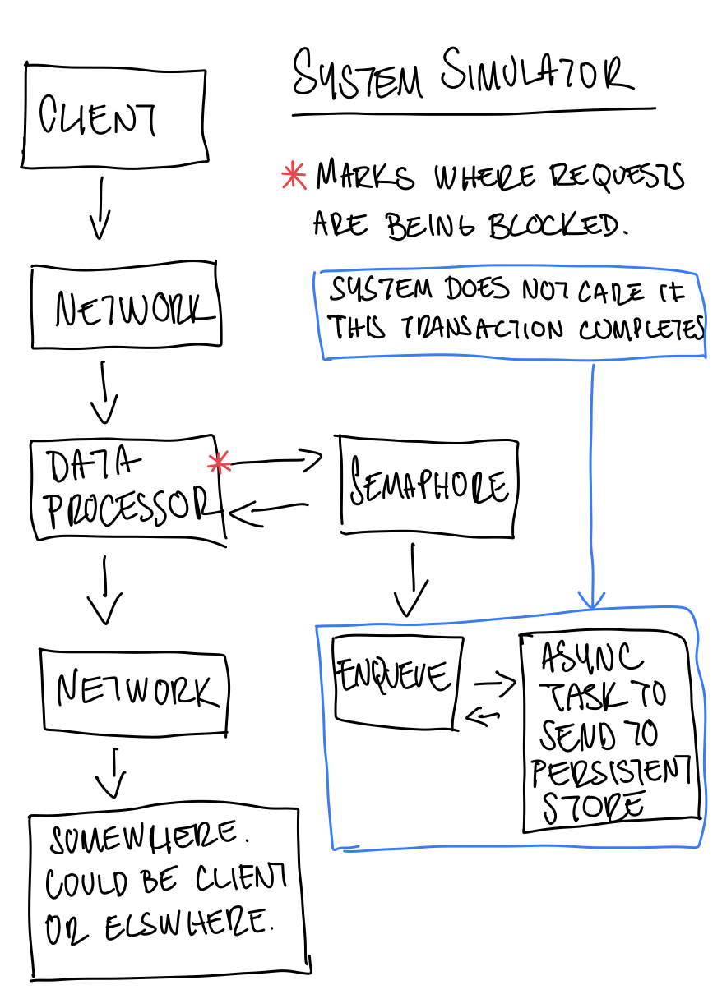

# System simulator troubleshooting rundown

## Problem statement

The system only completes all requests under extremely light load.

The following observations are taken using a MacBook Air (M1, 2020) with 16GB RAM.

- Requests start getting blocked at 8 clients running in parallel.

- Packet delay variation (or jitter). There is no correlation between the amount of clients and the variance in delay (is there?). Also all requests are going through so you can rule out things like network packet drops due to kernel TCP backlog overflow.

- Latency variation in persistent storage transactions. Not relevant to the requests being dropped as the data processor does not care if these transactions are successful or not. This variance could potentially cause a bottleneck in the semaphore queue though.

- All these tests are assumed to be run in an isolated environment, so the issue of noisy neighbours can be ruled out. 

### Solutions based on system requirements

- Care about performance rather that whether all requests complete.
- Care about whether all requests complete rather than performance.

### Open questions

- What is the system storing? Are all requests storing elements that are all the same size? Or are they different sizes? If elements are all different sizes then that can account for variance in performance. Check for correlation between network time and persistent storage time

## System diagram



## Troubleshooting

Below are the results of all the readings I have taken. As a rule of thumb I normally take 3 samples of data per debugging script, to rule out glitches or a result that looks wildly different for some unrelated reason. In this case there were no major differences each time I ran the scripts, so for brevity's sake I have only included one of the runs per different load amount.

### Summary of requests

Here I am running a script which counts the total requests for each of `request-block`, `request-nonblock`, `requests-start`, `request-done`, `persist-started`, and `persist-done` during a minute under different load.

These are my findings:

- Regardless of load, all requests are completed.
- Under very light load all requests go through without being blocked.
- While still on light load (15 clients), slightly less than half of the requests are getting blocked.
- Under medium load (125 clients), little less than 75% of requests are blocked.
- When I increased the medium load slightly (135 clients), most requests are blocked (i.e. 8 out of 7733 are not blocked)
- Under heavy load (1000 clients), all requests are blocked.

Results of running the [request count](./scripts/count.sh) DTrace script on different loads:

<details>

#### Running the count script using 1 client

```console
CPU     ID                    FUNCTION:NAME
  4   5281                        :tick-60s 

  non blocked requests                                             60
  persistent writes done                                           60
  persistent writes started                                        60
  requests done                                                    60
  requests started                                                 60
```

#### Running the count script using 15 clients

```console
CPU     ID                    FUNCTION:NAME
  4   5281                        :tick-60s 

  blocked requests                                                283
  non blocked requests                                            617
  persistent writes done                                          898
  persistent writes started                                       900
  requests done                                                   900
  requests started                                                900
```

#### Running the count script using 125 clients

```console
CPU     ID                    FUNCTION:NAME
  6   5281                        :tick-60s 

  blocked requests                                               2802
  non blocked requests                                           4622
  requests done                                                  7423
  persistent writes started                                      7424
  requests started                                               7424
  persistent writes done                                         7425
```

#### Running the count script using 135 clients

```console
CPU     ID                    FUNCTION:NAME
  5   5281                        :tick-60s 

  non blocked requests                                              8
  blocked requests                                               7733
  requests done                                                  7739
  persistent writes done                                         7740
  persistent writes started                                      7740
  requests started                                               7740
```

#### Running the count script using 1000 clients

```console
CPU     ID                    FUNCTION:NAME
  4   5281                        :tick-60s 

  blocked requests                                               7679
  requests started                                               7679
  requests done                                                  7680
  persistent writes done                                         7681
  persistent writes started                                      7681
```
</details>

## Request lifetime duration

The first tests I was taking request lifetime duration readings for 1 minute under different load. These are my findings:

- The average on lighter load is ~6608681 which is higher than the average on medium (15 clients and ~3991609ns), high (125 clients and ~4760868ns), and max (1000 clients and ~3384652ns).
- It is interesting how when running 1000 clients at the same time, the total of requests processed goes down to ~3800 from ~4666 when I was running 125 clients (at 125 clients about 25% of requests are not being blocked).

Results of running the [request lifetime](./scripts/request-lifetime.sh) DTrace script on different loads:
<details>

#### Running the request lifetimes script using 1 client (no requests are blocked)

```console
Summary of all request lifetimes taken in one minute represented in nanoseconds:
  total requests                                                   60
  average request lifetime                                    6565760
  max request lifetime                                        8324958
  min request lifetime                                        5459416
  request lifetimes visualisation                   
           value  ------------- Distribution ------------- count    
         2097152 |                                         0        
         4194304 |@@@@@@@@@@@@@@@@@@@@@@@@@@@@@@@@@@@@@@@@ 60       
         8388608 |                                         0 
```

#### Running the request lifetimes script using 15 clients (some requests are blocked)

```console
Summary of all request lifetimes taken in one minute represented in nanoseconds:
  total requests                                                  176
  average request lifetime                                    3829997
  max request lifetime                                        8240208
  min request lifetime                                         265125
  request lifetimes visualisation                   
           value  ------------- Distribution ------------- count    
          131072 |                                         0        
          262144 |                                         2        
          524288 |                                         1        
         1048576 |@@@@@@@@@@                               44       
         2097152 |@@@@@@@@@@@@                             52       
         4194304 |@@@@@@@@@@@@@@@@@@                       77       
         8388608 |                                         0
```

#### Running the request lifetimes script using 125 clients (some requests are blocked)

```console
Summary of all request lifetimes taken in one minute represented in nanoseconds:
  total requests                                                 4666
  average request lifetime                                    4697868
  max request lifetime                                       23316875
  min request lifetime                                          16875
  request lifetimes visualisation                   
           value  ------------- Distribution ------------- count    
            8192 |                                         0        
           16384 |                                         11       
           32768 |                                         13       
           65536 |                                         1        
          131072 |                                         15       
          262144 |@                                        62       
          524288 |                                         42       
         1048576 |@@@@@                                    586      
         2097152 |@@@@@@@@@@@@@                            1519     
         4194304 |@@@@@@@@@@@@@@@@@@                       2128     
         8388608 |@@                                       274      
        16777216 |                                         15       
        33554432 |                                         0
```

#### Running the request lifetimes script using 135 clients (all requests are blocked)

```console
Summary of all request lifetimes taken in one minute represented in nanoseconds:
  total requests                                                 3961
  average request lifetime                                    4409304
  max request lifetime                                       33164500
  min request lifetime                                          32708
  request lifetimes visualisation                   
           value  ------------- Distribution ------------- count    
            8192 |                                         0        
           16384 |                                         1        
           32768 |                                         1        
           65536 |                                         12       
          131072 |@                                        78       
          262144 |@@                                       191      
          524288 |@                                        75       
         1048576 |@@@@@@@                                  731      
         2097152 |@@@@@@@@@@@@@@@                          1491     
         4194304 |@@@@@@@@@                                885      
         8388608 |@@@@                                     425      
        16777216 |@                                        71       
        33554432 |                                         0 
```

#### Running the request lifetimes script using 1000 clients (all requests are blocked)

```console
Summary of all request lifetimes taken in one minute represented in nanoseconds:
  total requests                                                 3775
  average request lifetime                                    3403925
  max request lifetime                                       38066959
  min request lifetime                                          59834
  request lifetimes visualisation                   
           value  ------------- Distribution ------------- count    
           16384 |                                         0        
           32768 |                                         3        
           65536 |                                         14       
          131072 |@@@@@@@@@@                               988      
          262144 |@@@@                                     360      
          524288 |                                         15       
         1048576 |@@@@@                                    500      
         2097152 |@@@@@@@@@                                844      
         4194304 |@@@@@@@                                  681      
         8388608 |@@@                                      301      
        16777216 |@                                        65       
        33554432 |                                         4        
        67108864 |                                         0
```

</details>

## Writing to persistent storage duration

Even though the data processor doesn't wait for the persistent storage actions to complete, it is important to see how they behave under different load to determine how they correlate to the request blockage problem.

I took persistent store transaction duration readings for 1 minute under different load. These are my findings:

- It seems that during medium load when several requests are blocked (50% - 75%), the persistent store transactions take less time to complete.

- Under high load after most requests start being blocked, the latency increases slightly and plateaus.

Results of running the [persistent store transactions](./scripts/persist-time.sh) DTrace script on different loads:

<details>

#### Running persist-time script using 1 client

```console
Summary of all writes to persistent storage taken in one minute represented in nanoseconds:
  total writes                                                     58
  average write                                            1056537086
  max write                                                4096332625
  min write                                                  55025666
  visualisation of writes                           
           value  ------------- Distribution ------------- count    
        16777216 |                                         0        
        33554432 |@@@@@@@@@@@@@@                           20       
        67108864 |@@@@                                     6        
       134217728 |                                         0        
       268435456 |                                         0        
       536870912 |@@@@@                                    7        
      1073741824 |@@@@@@@@@@@@                             18       
      2147483648 |@@@@@                                    7        
      4294967296 |                                         0
```

#### Running persist-time script using 15 clients

```console
Summary of all writes to persistent storage taken in one minute represented in nanoseconds:
  total writes                                                    358
  average write                                              95680837
  max write                                                4158929375
  min write                                                     30542
  visualisation of writes                           
           value  ------------- Distribution ------------- count    
            8192 |                                         0        
           16384 |                                         1        
           32768 |                                         0        
           65536 |                                         2        
          131072 |                                         3        
          262144 |                                         2        
          524288 |                                         1        
         1048576 |@@@@@@@@                                 69       
         2097152 |@@@@@@                                   50       
         4194304 |@@                                       18       
         8388608 |@                                        7        
        16777216 |                                         0        
        33554432 |@@@@@@@@@@@@@@@@@@@@                     180      
        67108864 |@                                        8        
       134217728 |                                         0        
       268435456 |                                         0        
       536870912 |@@                                       15       
      1073741824 |                                         0        
      2147483648 |                                         2        
      4294967296 |                                         0 
```

#### Running persist-time script using 125 clients

```console
Summary of all writes to persistent storage taken in one minute represented in nanoseconds:
  total writes                                                   5088
  average write                                              15728164
  max write                                                 954772500
  min write                                                     18667
  visualisation of writes                           
           value  ------------- Distribution ------------- count    
            8192 |                                         0        
           16384 |                                         1        
           32768 |                                         0        
           65536 |                                         11       
          131072 |                                         11       
          262144 |                                         2        
          524288 |                                         2        
         1048576 |@@@                                      428      
         2097152 |@@@@@@@                                  880      
         4194304 |@@@@@@@                                  919      
         8388608 |@@@@@@@@@@@@                             1467     
        16777216 |@@@@@@@@                                 1063     
        33554432 |@@                                       207      
        67108864 |                                         42       
       134217728 |                                         34       
       268435456 |                                         18       
       536870912 |                                         3        
      1073741824 |                                         0 
```

#### Running persist-time script using 135 clients

```console
Summary of all writes to persistent storage taken in one minute represented in nanoseconds:
  total writes                                                   5904
  average write                                              16260669
  max write                                                 518956458
  min write                                                     47500
  visualisation of writes                           
           value  ------------- Distribution ------------- count    
           16384 |                                         0        
           32768 |                                         2        
           65536 |                                         21       
          131072 |                                         12       
          262144 |                                         4        
          524288 |                                         4        
         1048576 |@@@@                                     597      
         2097152 |@@@@@@@                                  1027     
         4194304 |@@@@@@@                                  1017     
         8388608 |@@@@@@@@@                                1375     
        16777216 |@@@@@@@@                                 1195     
        33554432 |@@@@                                     523      
        67108864 |@                                        86       
       134217728 |                                         32       
       268435456 |                                         9        
       536870912 |                                         0
```

#### Running persist-time script using 1000 clients

```console
  total writes                                                   4282
  average write                                              19894690
  max write                                                3828975459
  min write                                                     17834
  visualisation of writes                           
           value  ------------- Distribution ------------- count    
            8192 |                                         0        
           16384 |                                         4        
           32768 |                                         4        
           65536 |                                         12       
          131072 |                                         3        
          262144 |                                         0        
          524288 |                                         0        
         1048576 |@@                                       226      
         2097152 |@@@@                                     476      
         4194304 |@@@@@@@                                  729      
         8388608 |@@@@@@@@@@@                              1163     
        16777216 |@@@@@@@@@@@                              1193     
        33554432 |@@@                                      360      
        67108864 |@                                        64       
       134217728 |                                         40       
       268435456 |                                         7        
       536870912 |                                         0        
      1073741824 |                                         0        
      2147483648 |                                         1        
      4294967296 |                                         0
```

</details>

### CPU usage

I will record CPU usage to have as a reference for when I implement a solution. This will help compare results and verify that a solution does not affect other parts of the system.

The [cpu usage](./scripts/cpu-usage.sh) scripts takes readings of the process at a set interval for a minute.

Findings:

- CPU usage spikes drastically once the blockage becomes more prevalent, ~20% under medium load (125-135 clients) and 47% under high load (1000 clients) 

<details>

#### Running CPU usage script using 1 client for 1 minute

```console
TIMESTAMP  PID    %CPU    PROCESS
13:00:25  17887   0.1 system-simulator
13:00:37  17887   0.1 system-simulator
13:00:49  17887   0.0 system-simulator
13:01:01  17887   0.0 system-simulator
13:01:13  17887   0.0 system-simulator
```

#### Running CPU usage script using 15 clients for 1 minute

```console
TIMESTAMP  PID    %CPU    PROCESS
13:12:27  18084   0.2 system-simulator
13:12:39  18084   0.3 system-simulator
13:12:51  18084   0.4 system-simulator
13:13:03  18084   0.9 system-simulator
13:13:15  18084   1.5 system-simulator
```

#### Running CPU usage script using 125 clients for 1 minute

```console
TIMESTAMP  PID    %CPU    PROCESS
13:24:44  18263  15.4 system-simulator
13:24:56  18263  18.5 system-simulator
13:25:08  18263  15.6 system-simulator
13:25:20  18263  17.8 system-simulator
13:25:32  18263  18.5 system-simulator
```

#### Running CPU usage script using 135 clients for 1 minute

```console
TIMESTAMP  PID    %CPU    PROCESS
13:26:41  18466  22.2 system-simulator
13:26:53  18466  18.7 system-simulator
13:27:05  18466  22.4 system-simulator
13:27:17  18466  20.4 system-simulator
13:27:29  18466  21.8 system-simulator
```

#### Running CPU usage script using 1000 clients for 1 minute

```console
TIMESTAMP  PID    %CPU    PROCESS
15:21:01  19186  41.5 system-simulator
15:21:13  19186  58.9 system-simulator
15:21:25  19186  41.9 system-simulator
15:21:37  19186  52.9 system-simulator
15:21:49  19186  62.1 system-simulator
```
</details>

## Request blockage issue

A bottleneck was being created due to the data processor semaphore permits not scaling with the amount of requests changed. I took the amount of permits that worked for a single client and multiplied that by the number of clients.

```rust
sem: Arc::new(Semaphore::new(PERSIST_N)),
```
to

```rust
sem: Arc::new(Semaphore::new(PERSIST_N * N_CLIENTS)),
```

Results after semaphore optimisation:

### Summary of requests

There are no blocked requests under any amount of load any more.

The amount of requests does not plateau at a certain load, and they are proportional to the amount of clients being run. 

<details>

#### Running a single client:

```console
CPU     ID                    FUNCTION:NAME
  5   5281                        :tick-60s 

  non blocked requests                                             60
  persistent writes done                                           60
  persistent writes started                                        60
  requests done                                                    60
  requests started                                                 60
```

#### Under light load (15 clients):

```console
CPU     ID                    FUNCTION:NAME
  4   5281                        :tick-60s 

  non blocked requests                                            885
  persistent writes done                                          885
  persistent writes started                                       885
  requests done                                                   885
  requests started                                                885
```

#### Under medium load (125 clients):

```console
CPU     ID                    FUNCTION:NAME
  4   5281                        :tick-60s 

  non blocked requests                                           7375
  persistent writes done                                         7375
  persistent writes started                                      7375
  requests done                                                  7375
  requests started                                               7375
```

#### Under medium/high load (135 clients):

```console
CPU     ID                    FUNCTION:NAME
  6   5281                        :tick-60s 

  non blocked requests                                           7965
  persistent writes done                                         7965
  persistent writes started                                      7965
  requests done                                                  7965
  requests started                                               7965
```

#### Under high load (1000 clients):

```console
CPU     ID                    FUNCTION:NAME
  4   5281                        :tick-60s 

  persistent writes done                                        59000
  non blocked requests                                          59002
  persistent writes started                                     59002
  requests done                                                 59002
  requests started                                              59002
```

</details>

#### Request lifetime duration on a single thread

While variance has been reduced significantly, the trend is still to have the request lifetime reduced the higher the load. ~6541583ns average request lifetime when running a single client, ~2215251ns average request lifetime when running 135 clients, and ~852957ns when running 1000 clients.

<details>

#### Running a single client:

```console
Summary of all request lifetimes taken in one minute represented in nanoseconds:
  total requests                                                   59
  average request lifetime                                    6541583
  max request lifetime                                        8448000
  min request lifetime                                        4970334
  request lifetimes visualisation                   
           value  ------------- Distribution ------------- count    
         2097152 |                                         0        
         4194304 |@@@@@@@@@@@@@@@@@@@@@@@@@@@@@@@@@@@@@@@  58       
         8388608 |@                                        1        
        16777216 |                                         0 
```

#### Under light load (15 clients):

```console
Summary of all request lifetimes taken in one minute represented in nanoseconds:
  total requests                                                   60
  average request lifetime                                    5591203
  max request lifetime                                        7801958
  min request lifetime                                        2574625
  request lifetimes visualisation                   
           value  ------------- Distribution ------------- count    
         1048576 |                                         0        
         2097152 |@@@                                      4        
         4194304 |@@@@@@@@@@@@@@@@@@@@@@@@@@@@@@@@@@@@@    56       
         8388608 |                                         0
```

#### Under medium load (125 clients):

```console
Summary of all request lifetimes taken in one minute represented in nanoseconds:
  total requests                                                   59
  average request lifetime                                    3666190
  max request lifetime                                        4411583
  min request lifetime                                         469375
  request lifetimes visualisation                   
           value  ------------- Distribution ------------- count    
          131072 |                                         0        
          262144 |@                                        1        
          524288 |                                         0        
         1048576 |                                         0        
         2097152 |@@@@@@@@@@@@@@@@@@@@@@@@@@@@@@@@@@@@     53       
         4194304 |@@@                                      5        
         8388608 |                                         0 
```

#### Under medium/high load (135 clients):

```console
Summary of all request lifetimes taken in one minute represented in nanoseconds:
  total requests                                                  113
  average request lifetime                                    2215251
  max request lifetime                                        5576791
  min request lifetime                                          51250
  request lifetimes visualisation                   
           value  ------------- Distribution ------------- count    
           16384 |                                         0        
           32768 |@                                        2        
           65536 |                                         0        
          131072 |                                         1        
          262144 |@@                                       7        
          524288 |@@@@@@@@@@@@@@@@                         46       
         1048576 |                                         1        
         2097152 |@@@@@@@@@@@@@@@@@@@                      53       
         4194304 |@                                        3        
         8388608 |                                         0
```

#### Under high load (1000 clients):

```console
Summary of all request lifetimes taken in one minute represented in nanoseconds:
  total requests                                                  884
  average request lifetime                                     852957
  max request lifetime                                        8379833
  min request lifetime                                           7500
  request lifetimes visualisation                   
           value  ------------- Distribution ------------- count    
            2048 |                                         0        
            4096 |                                         1        
            8192 |                                         0        
           16384 |                                         0        
           32768 |                                         0        
           65536 |                                         0        
          131072 |                                         0        
          262144 |@@@@@@@@                                 176      
          524288 |@@@@@@@@@@@@@@@@@@@@@@@@@@@@             618      
         1048576 |@@                                       36       
         2097152 |@                                        26       
         4194304 |@                                        27       
         8388608 |                                         0
```

</details>

#### Writing to persistent storage duration on a single OS thread

Since more threads are spawned due to the increase in the semaphore permits, each new thread processes less writes. This reduces variance in each thread.

<details>

#### Running a single client:

```console
Summary of all writes to persistent storage taken in one minute represented in nanoseconds:
  total writes                                                     59
  average write                                            1023451518
  max write                                                5112237834
  min write                                                  57745084
  visualisation of writes                           
           value  ------------- Distribution ------------- count    
        16777216 |                                         0        
        33554432 |@@@@@@@@@                                14       
        67108864 |@@@@                                     6        
       134217728 |                                         0        
       268435456 |                                         0        
       536870912 |@@@@@@@@                                 12       
      1073741824 |@@@@@@@@@@@@@@@@                         24       
      2147483648 |@                                        2        
      4294967296 |@                                        1        
      8589934592 |                                         0
```

#### Under light load (15 clients):

```console
Summary of all writes to persistent storage taken in one minute represented in nanoseconds:
  total writes                                                    171
  average write                                             139800622
  max write                                                4105406000
  min write                                                  51638417
  visualisation of writes                           
           value  ------------- Distribution ------------- count    
        16777216 |                                         0        
        33554432 |@@@@@@@@@@@@@@@@@@@@@@@@@@@@@@@@@@@@@@   164      
        67108864 |                                         0        
       134217728 |                                         0        
       268435456 |                                         0        
       536870912 |                                         1        
      1073741824 |@                                        4        
      2147483648 |                                         2        
      4294967296 |                                         0
```

#### Under medium load (125 clients):

```console
Summary of all writes to persistent storage taken in one minute represented in nanoseconds:
  total writes                                                    227
  average write                                              61112287
  max write                                                1076288000
  min write                                                  44318958
  visualisation of writes                           
           value  ------------- Distribution ------------- count    
        16777216 |                                         0        
        33554432 |@@@@@@@@@@@@@@@@@@@@@@@@@@@@@@@@@@@@@@@@ 225      
        67108864 |                                         0        
       134217728 |                                         0        
       268435456 |                                         0        
       536870912 |                                         1        
      1073741824 |                                         1        
      2147483648 |                                         0
```

#### Under medium/high load (135 clients):

```console
Summary of all writes to persistent storage taken in one minute represented in nanoseconds:
  total writes                                                    232
  average write                                              51078164
  max write                                                  62577042
  min write                                                  43816666
  visualisation of writes                           
           value  ------------- Distribution ------------- count    
        16777216 |                                         0        
        33554432 |@@@@@@@@@@@@@@@@@@@@@@@@@@@@@@@@@@@@@@@@ 232      
        67108864 |                                         0 
```

#### Under high load (1000 clients):

```console
Summary of all writes to persistent storage taken in one minute represented in nanoseconds:
  total writes                                                    293
  average write                                              16911109
  max write                                                2080384709
  min write                                                     46125
  visualisation of writes                           
           value  ------------- Distribution ------------- count    
           16384 |                                         0        
           32768 |                                         2        
           65536 |                                         2        
          131072 |                                         1        
          262144 |                                         0        
          524288 |                                         1        
         1048576 |@@@                                      23       
         2097152 |@@@@@@@@                                 62       
         4194304 |@@@@@@@@@@@@@@                           100      
         8388608 |@@@@@@@                                  54       
        16777216 |@@@@@                                    33       
        33554432 |@@                                       14       
        67108864 |                                         0        
       134217728 |                                         0        
       268435456 |                                         0        
       536870912 |                                         0        
      1073741824 |                                         1        
      2147483648 |                                         0 
```
</details>

#### CPU usage

These percentages have been drastically reduced. At the highest load (1000 clients) we were previously at around 45% CPU usage. With the semaphore adjustment the percentage has been reduced to about ~5% on average.

<details>

#### Running a single client:

```console
TIMESTAMP  PID    %CPU    PROCESS
18:06:14  22854   0.0 system-simulator
18:06:26  22854   0.0 system-simulator
18:06:38  22854   0.0 system-simulator
18:06:50  22854   0.0 system-simulator
18:07:02  22854   0.0 system-simulator
```

#### Under light load (15 clients):

```console
TIMESTAMP  PID    %CPU    PROCESS
18:10:27  22239   0.4  system-simulator
18:10:39  22239   0.8  system-simulator
18:10:51  22239   0.7  system-simulator
18:11:03  22239   0.0  system-simulator
18:11:15  22239   0.0  system-simulator
```

#### Under medium load (125 clients):

```console
TIMESTAMP  PID    %CPU    PROCESS
18:12:25  22319   1.1  system-simulator
18:12:37  22319   2.5  system-simulator
18:12:49  22319   4.5  system-simulator
18:13:01  22319   5.0  system-simulator
18:13:13  22319   0.0  system-simulator
```

#### Under medium/high load (135 clients):

```console
TIMESTAMP  PID    %CPU    PROCESS
18:14:00  22482   2.0  system-simulator
18:14:12  22482   3.7  system-simulator
18:14:24  22482   6.5  system-simulator
18:14:36  22482   0.2  system-simulator
18:14:48  22482   0.1  system-simulator
```

#### Under high load (1000 clients):

```console
TIMESTAMP  PID    %CPU    PROCESS
18:16:18  22645  10.9  system-simulator
18:16:30  22645   9.1  system-simulator
18:16:42  22645   7.7  system-simulator
18:16:54  22645   2.1  system-simulator
18:17:06  22645   4.0  system-simulator
```
</details>

## Reducing variance even further

Although the change in semaphore permits has drastically reduced variance in performance, one can go even further to reduce the current range of time it takes to store each of the elements. This can be done by implementing multipart uploads with a queue mechanism.

While implementing the above falls out of the scope of this exercise, I can simulate it by changing:

```rust
impl Persist {
    pub fn new() -> Self {
        Self {
            rng: Normal::new(10_000.0, 5_000.0).unwrap(),
        }
    }
```

to

```rust
impl Persist {
    pub fn new() -> Self {
        Self {
            rng: Normal::new(10_000.0, 100.0).unwrap(),
        }
    }
```

__TODO: Add measurements of this change__

The current range for network delay is quite narrow, so for this system I don't think it's necessary to make any network changes.
